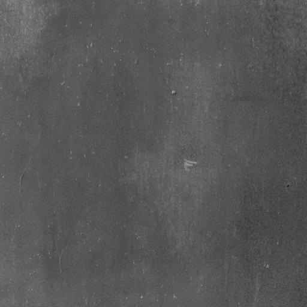

# Phong reflection model & Textures with WebGL
A interactive 3D visualization implemented with WebGL, which allows to understand how the Phong Reflection Model works.

## Lighting

Both the light position (x,y,z)  and the intensity of the three light components (ambiental, diffuse, specular) can be modified with sliders.

* [Phong reflection model](https://en.wikipedia.org/wiki/Phong_reflection_model)

## Textures
Different materials will reflect the light in a different way. One material can be choosen among the following three:

* Oxid Steel

* Wood

* Brick

## Try it !
* [Visit page](https://pabvald.github.io/lighting_and_textures/) 
* WebGL doesn't work in Chrome, so please, try it in Firefox preferably.
* Textures are loaded slowly so just wait 1 second if the cube is black or doesn't change.
